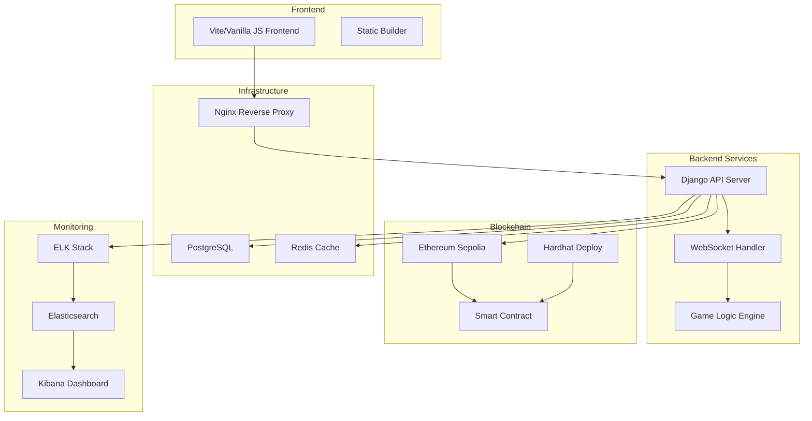
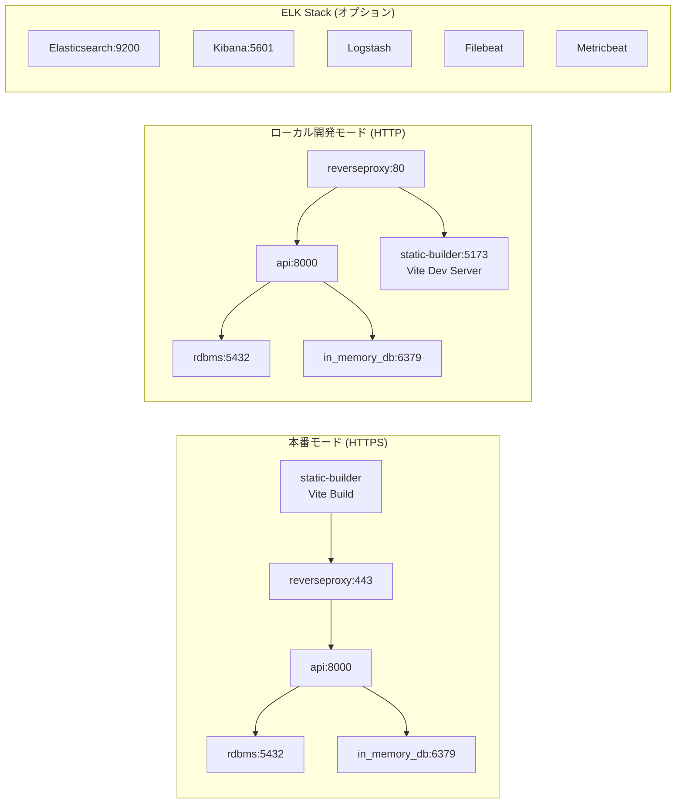
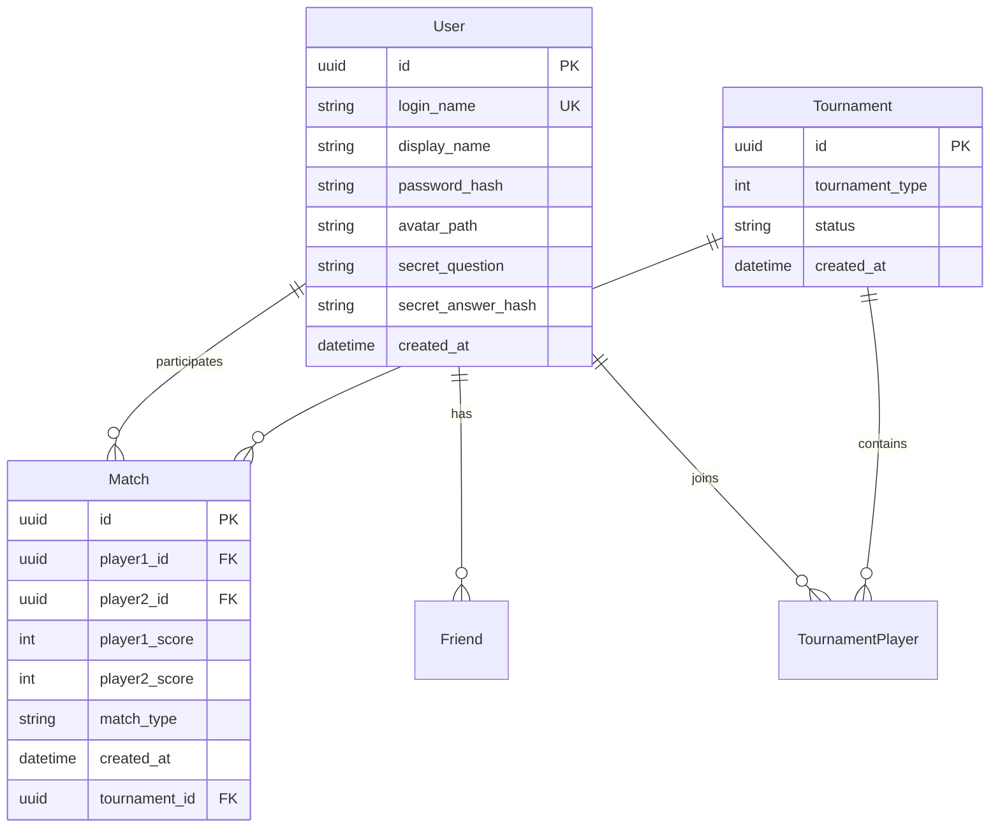

# ft_transcendence - リアルタイムPongゲームプラットフォーム

## 概要

ft_transcendenceは、42schoolの最終プロジェクトとして開発されたモダンなPongゲームプラットフォームです。リアルタイムマルチプレイヤー対戦、トーナメント機能、ブロックチェーンベースの試合記録、そして包括的なユーザー管理システムを提供します。

## 🎮 主な機能

- **リアルタイムPongゲーム**: WebSocketベースのローカル・リモート対戦
- **トーナメントシステム**: 4人・8人のトーナメント対戦
- **ブロックチェーン統合**: Ethereum Sepoliaネットワークでの試合記録保存
- **ユーザー管理**: JWT認証、フレンドシステム、プロフィール管理
- **リアルタイムログ監視**: ELKスタックによる包括的なログ分析
- **モダンフロントエンド**: Vite + Vanilla JS による軽量で高速なUI

## 🏗️ アーキテクチャ概要



## 🛠️ 技術スタック

### Frontend
- **Vite**: 高速ビルドツール
- **Vanilla JavaScript**: 軽量なフロントエンド実装
- **Bootstrap**: レスポンシブUIコンポーネント
- **SCSS**: スタイルシート管理

### Backend
- **Django 4.2**: Pythonウェブフレームワーク
- **Django Channels**: WebSocket対応
- **Django REST Framework**: REST API構築
- **JWT Authentication**: セキュアな認証システム

### Database & Cache
- **PostgreSQL 16**: メインデータベース
- **Redis 7.4**: セッション管理・キャッシュ

### Blockchain
- **Solidity**: スマートコントラクト言語
- **Hardhat**: Ethereum開発環境
- **Ethereum Sepolia**: テストネットワーク

### Infrastructure
- **Docker**: コンテナ化
- **Nginx**: リバースプロキシ・静的ファイル配信
- **ELK Stack**: ログ監視・分析

## 📋 システム構成

### コンテナ構成



### データベース設計



## 🚀 セットアップ・起動方法

### 前提条件
- Docker & Docker Compose
- make コマンド

### 起動手順

1. **プロジェクトクローン**
   ```bash
   git clone <repository-url>
   cd ft_transcendence
   ```

2. **基本起動（本番モード・HTTPS）**
   ```bash
   make
   # または
   make run
   ```
   - SSL証明書の自動生成
   - 全サービスのビルド・起動
   - アクセス: https://localhost

3. **ローカル開発モード（HTTP）**
   ```bash
   make local
   ```
   - SSL証明書不要
   - フロントエンドの開発サーバー起動
   - アクセス: http://localhost

### Makeコマンド一覧

| コマンド | 説明 |
|---------|------|
| `make` / `make run` | 本番モード起動（ビルド→起動） |
| `make local` | ローカル開発モード起動 |
| `make re` | 完全再構築（ダウン→イメージ削除→起動） |
| `make build` | イメージビルドのみ |
| `make up` | サービス起動のみ |
| `make down` | サービス停止 |
| `make fdown` | 強制停止（ボリューム削除） |
| `make ps` | コンテナ状況確認 |
| `make cert_clean` | SSL証明書削除 |

### 環境設定ファイル

プロジェクトには環境設定のサンプルファイルが含まれています：

- `.env.sample`: 本番モード用（HTTPS）
- `.env.sample.local`: ローカル開発用（HTTP）

これらをベースに必要に応じて環境変数を調整してください。

### アクセスURL

- **メインアプリケーション**: 
  - 本番モード: https://localhost
  - ローカル開発: http://localhost
- **開発サーバー**: http://localhost:5173 (ローカルモード時)
- **PostgreSQL**: localhost:5432
- **Redis**: localhost:6379
- **Kibana**: http://localhost:5601 (ELK有効時)

## 🎯 API仕様

### REST API
- **Base URL**: `https://localhost/api`
- **認証**: JWT Bearer Token
- **詳細仕様**: [openapi.yaml](./openapi.yaml)

### WebSocket API
- **Base URL**: `wss://localhost/api/ws`
- **チャンネル**: ゲーム・トーナメント・ルーム管理
- **詳細仕様**: [asyncapi.yaml](./asyncapi.yaml)

## 🔗 ブロックチェーン統合

### スマートコントラクト機能
- 試合結果の不変記録
- プレイヤースコア保存
- 透明性のある履歴管理

### デプロイ手順
```bash
cd api/blockchain/deploy
npm install
npx hardhat run scripts/deploy.js --network sepolia
```

## 📊 監視・ログ（ELKスタック）

### ELKスタック構成
- **Elasticsearch**: ログデータ検索・保存
- **Logstash**: ログデータ処理・変換
- **Kibana**: ログデータ可視化
- **Filebeat**: ログファイル収集
- **Metricbeat**: システムメトリクス収集

### ELK有効化
```bash
# ELKスタックを含めて起動
docker compose --env-file .env.sample -f docker-compose.yml -f elk/docker-compose.yml up -d

# ELKセットアップ実行
make setup-elk
```

### アクセス方法
1. Kibana: http://localhost:5601
2. Elasticsearch: http://localhost:9200
3. 事前設定済みダッシュボードとインデックスパターンを利用可能

**注意**: Makefileでは現在ELKスタックがコメントアウトされており、必要に応じて手動で有効化してください。

## 🛡️ セキュリティ機能

- **JWT認証**: アクセストークンによる認証
- **HTTPS通信**: SSL/TLS暗号化
- **CSRF保護**: Django標準保護機能
- **入力検証**: Django REST frameworkによる検証
- **パスワードハッシュ化**: Django標準ハッシュ機能

## 🧪 テスト

```bash
# バックエンドテスト
docker-compose exec api python manage.py test

# フロントエンドリント
cd static-builder
npm run lint
```

## 📁 プロジェクト構造

```
ft_transcendence/
├── api/                      # Django バックエンド
│   ├── conf/                 # Django設定・アプリケーション
│   ├── blockchain/           # ブロックチェーン統合
│   └── Dockerfile           # API用Dockerfile
├── static-builder/          # Vite フロントエンド
│   ├── src/js/              # JavaScript ソースコード
│   ├── src/scss/            # SCSS スタイルシート
│   └── vite.config.js       # Vite設定
├── reverseproxy/            # Nginx設定
├── elk/                     # ELKスタック設定
├── docker-compose.yml       # メインサービス定義
├── asyncapi.yaml           # WebSocket API仕様
├── openapi.yaml            # REST API仕様
└── Makefile                # 便利コマンド集
```

## 🤝 コントリビューション

1. フォークしてクローン
2. フィーチャーブランチ作成
3. 変更をコミット
4. プルリクエスト作成

## 📄 ライセンス

MIT License

## 👥 開発チーム

42tokyo ft_transcendence チーム

---

**注意**: このプロジェクトは教育目的で開発されており、本番環境での使用には追加のセキュリティ設定が必要です。